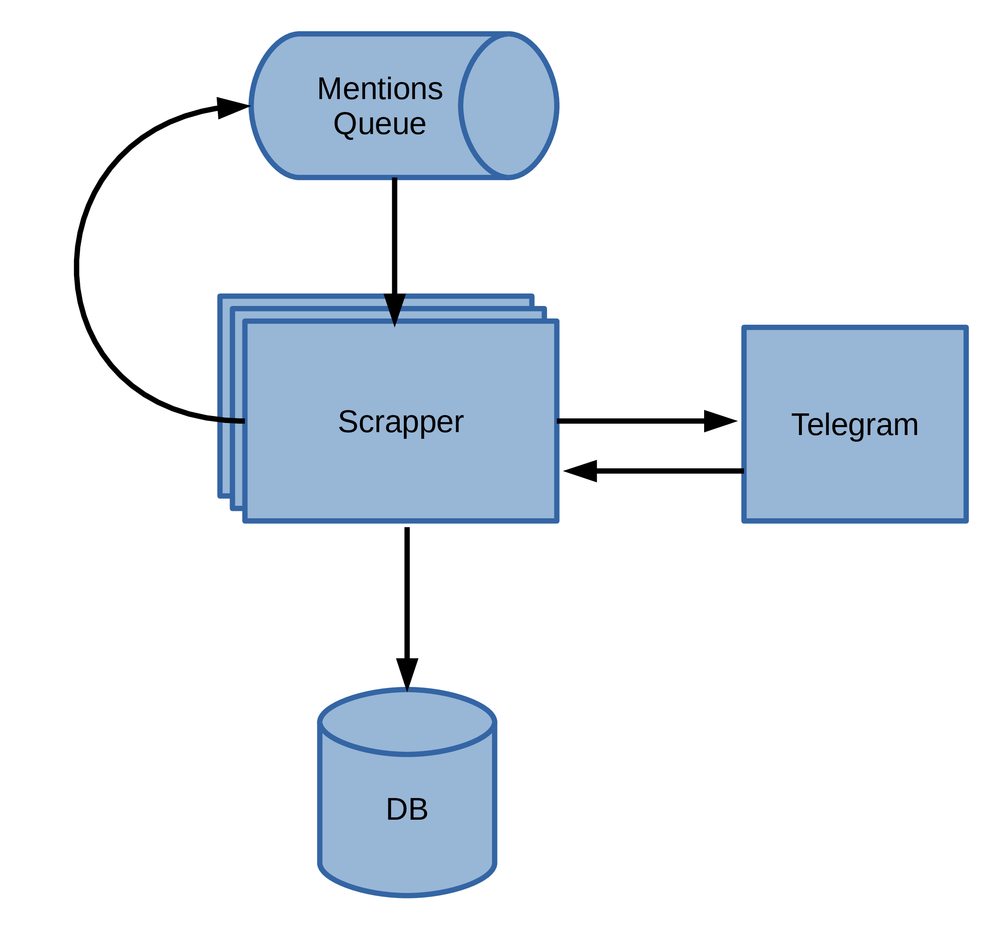

# telegram-scrapper
Telegram webChannel scrapper. It based on Telegram web version.

## Goal
Collect Russian news from public Telegram channels. 
Also, it can be extended for other languages. 

## Extracted entities
 - webChannel info
   - name
   - title
   - description
   - subscribers count  
 - message info
    - text 
    - links
    - forwarding
    - mentions
    - views count
    - publish date
    - etc

Detailed info about stored entities present in [DB scheme](persistence/src/main/resources/schema/schema.sql)

## Architecture

### Queue
The system requires initial list of channels, that should be present in queue.
New extracted channels also will be stored in queue. 
Currently, only SQL queue supported. 
Schema and initial channels present [here](persistence/src/main/resources/schema/queue-schema.sql).

### Database
Currently, only PostgreSQL database supported. 
Schema present [here](persistence/src/main/resources/docker-compose.yml)

### Scraper
Scraper booked few channels from queue, analyzes it and stores extracted info to database.
Found webChannel mentions will be stored to queue, old channels will be marked as processed.
The module is synchronizes by mentions queue and can be launched in multiple instances.



## Configuration

### External dependencies:
- Installed and [configured](https://stackoverflow.com/questions/1969958/how-to-change-the-tor-exit-node-programmatically-to-get-a-new-ip) Tor (to avoid Telegram blocking)
- Configured PostgreSQL database (use prepared [docker-compose](persistence/src/main/resources/docker-compose.yml) for example).

### Scraper config
All scraper settings specified in scraper [application.yml](scraper/src/main/resources/application.yml) file.
- ``app.pool.poolSize`` - threads of scraper application
- ``tor.host`` - host, where Tor running
- ``tor.socksPort`` - Tor SOCKS 5 port
- ``tor.controlPort`` - Tor control port
- ``tor.password`` - Password for Tor NYM changing
- ``db.url`` - JDBC URL for database connection
- ``db.username`` - Username for DB user
- ``db.password`` - Password for DB user
- ``telegram.limits.minTimeRangeMs`` - min time between requests to Telegram (``t_min``). Final awaiting time will be calculated as ``T = t_min + (t_max - t_min)|sin(t)|``  
- ``telegram.limits.maxTimeRangeMs`` - max time between requests to Telegram (``t_max``). Should be equals or greater than ``telegram.limits.minTimeRangeMs``
- ``scraper.messagesCount`` -  messages count that scraper reads from Telegram. In general, the scraper reads a little bit more than the specified count.
- ``scraper.maxFailures`` - Max errors number in a row to read info about channels. 
  Errors counter will be restored to 0 after successful attempt. 
  If unsuccessful attempts count to read info about channels will be reached ``scraper.maxFailures`` then all channels, that were marked as unreadable, will be restored as unprocessed.
  Scrapper will be stopped.
  This is **the most important** setting. 
  You need to manually define its value. 
  Telegram, on suspicion of scraping, will try to block access to its resources. 
  To do this, the program uses Tor to avoid blocking by IP address. 
  But also in the web version it is impossible to read information about private channels, bots, groups, etc. 
  In all cases, Telegram returns one answer, so it is not possible to indicate whether a blocking has occurred.
  Run the program and check the logs: which channels will be marked as broken.


You can enable bot notifications for scraper failures. 
After ``scraper.maxFailures`` count will be reached, the scraper sends notification to specific Telegram channel and awaiting approval to stop or continue work.
Add the below properties to config file:

``` 
telegram.bot.chatId
telegram.bot.token
```

### Check environment
For checking database and Tor configurations, run integrations tests for scraper:

```
./gradlew scraper:integrationTest
```

### Data analysis

Collected data analysis present in branch ```analyzer``` and in future will be extracted to separate project.
Part of the future project is here: https://github.com/gnupinguin/spark-lda-coherence

## Run
```
git clone https://github.com/gnupinguin/telegram-scraper.git
cd telegram-scraper
./gradlew scraper:bootRun
```

